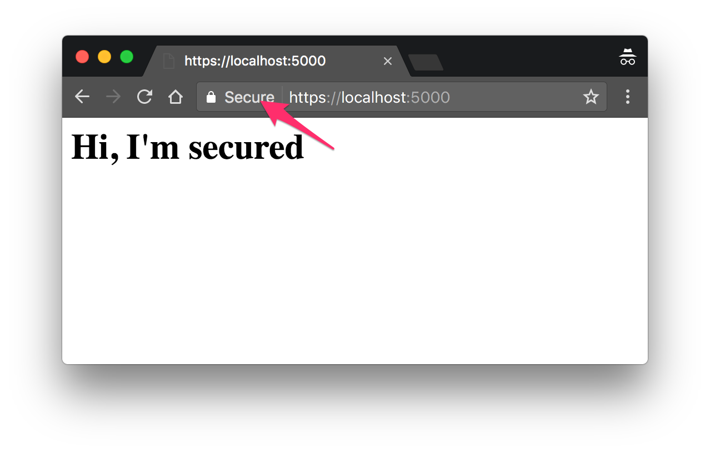
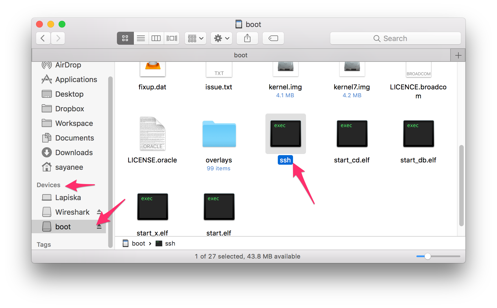
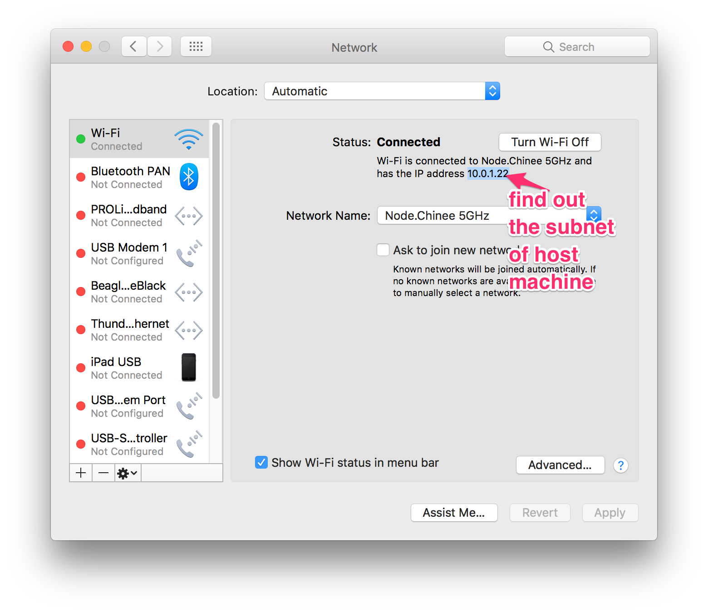

# demo

> Demo of a secure and insecure web page

## Table of Contents

1. [Getting started](#getting-started)
1. [Transfer code](#transfer-code)
1. [Setup DNS](#setup-dns)
1. [Bootup script](#bootup-script)
1. [Connect to WiFi](#connect-to-wifi)
1. [Sniff packets](#sniff-packets)

## Getting started

> Test out the [http and https servers on your laptop](http://blog.mgechev.com/2014/02/19/create-https-tls-ssl-application-with-express-nodejs/) (macbook) before transferring to a Raspberry PI

1. Install dependancies with `npm i`
1. Generate new certificates `key.pem` and `cert.pem`
    - Ensure `Common Name` is `localhost` or another domain name E.g. `lamp.local`

        ```sh
        $ openssl req -x509 -newkey rsa:2048 -keyout key.pem -out cert.pem -days 365

        Generating a 2048 bit RSA private key
        ......................+++
        ..........+++
        writing new private key to 'key.pem'
        Enter PEM pass phrase:
        Verifying - Enter PEM pass phrase:
        -----
        You are about to be asked to enter information that will be incorporated
        into your certificate request.
        What you are about to enter is what is called a Distinguished Name or a DN.
        There are quite a few fields but you can leave some blank
        For some fields there will be a default value,
        If you enter '.', the field will be left blank.
        -----
        Country Name (2 letter code) [AU]:SG
        State or Province Name (full name) [Some-State]:Singapore
        Locality Name (eg, city) []:Singapore
        Organization Name (eg, company) [Internet Widgits Pty Ltd]:IoT security demo
        Organizational Unit Name (eg, section) []:
        Common Name (e.g. server FQDN or YOUR name) []:lamp.local
        Email Address []:sayanee@gmail.com
        ```
1. Remove passphrase

    ```sh
    openssl rsa -in key.pem -out newkey.pem && mv newkey.pem key.pem
    ```
1. Add the certificates to KeyChain app
1. Ensure it is `Always Trust`

    
1. Ensure that common Name on certificate generation and domain name is `lamp.local`

    
1. Start the servers on host machine to test

    ```sh
    npm start
    ```
1. Visit <http://localhost:4000> and <https://localhost:5000> in browser
    - for `https`, accept the certificate

        

## Transfer code

1. Burn an SD card with a [non-GUI Raspbian OS](https://www.raspberrypi.org/downloads/)
1. Add an empty file called `ssh` in the SD card to [enable SSH in the headless RaspberryPI](https://www.raspberrypi.org/documentation/remote-access/ssh/)

    
1. Power on the RaspberryPI with Ethernet connected to the same router as host machine
1. Find the IP address of the host machine with Network Preferences

    
1. Find out the IP address of the RaspberryPI in the same network

    ```sh
    nmap --open -p 22 10.0.1.0-255

    Starting Nmap 7.40 ( https://nmap.org ) at 2017-03-25 15:23 SGT
    Nmap scan report for 10.0.1.7
    Host is up (0.00068s latency).
    PORT   STATE SERVICE
    22/tcp open  ssh
    ```

    Or Just view the DHCP client list from the router

    
1. Secure copy the demo code to RaspberryPI

    ```sh
    scp -r . pi@10.0.1.7:/home/pi/demo
    ```
1. SSH into the RaspberryPI with default password `raspberry

    ```sh
    ssh pi@10.0.1.7
    ```
1. Locate the `demo` transferred to the `home` directory

    ```sh
    pi@raspberrypi:~ $ ls -al

    total 32
    drwxr-xr-x 4 pi   pi   4096 Mar 25 07:21 .
    drwxr-xr-x 3 root root 4096 Mar  3 15:27 ..
    -rw------- 1 pi   pi    570 Mar 23 00:35 .bash_history
    -rw-r--r-- 1 pi   pi    220 Mar  3 15:27 .bash_logout
    -rw-r--r-- 1 pi   pi   3608 Mar 22 13:25 .bashrc
    drwxr-xr-x 5 pi   pi   4096 Mar 22 13:27 .nvm
    -rw-r--r-- 1 pi   pi    675 Mar  3 15:27 .profile
    drwxr-xr-x 4 pi   pi   4096 Mar 25 07:21 demo
    ```

## Setup DNS

1. Install dependency

    ```sh
    sudo apt-get install avahi-daemon
    ```
1. Change the `hostname` to add `lamp`, an IoT device in the network

    ```sh
    sudo cat /etc/hostname

    lamp
    ```
1. Change `hosts` to add `lamp.local`

    ```sh
    sudo cat /etc/hosts

    127.0.0.1	localhost lamp.local
    ::1		localhost ip6-localhost ip6-loopback
    ff02::1		ip6-allnodes
    ff02::2		ip6-allrouters

    127.0.1.1	lamp
    ```
1. Restart DNS daemon

    ```sh
    sudo /etc/init.d/avahi-daemon restart
    ```
1. Reboot RaspberryPI and SSH in again

    ```sh
    sudo reboot
    ssh pi@lamp.local # password: raspberry
    ```
1. Start the node server

    ```sh
    sudo /home/pi/.nvm/versions/node/v7.7.4/bin/node server.js
    ```
1. Check <http://lamp.local> and <https://lamp.local> on the host machine browser or any other mobile device in the same network

## Bootup script

> Run web server on [RaspberryPI on boot up](https://www.raspberrypi.org/documentation/linux/usage/rc-local.md)

1. Edit file `rc.local`

    ```sh
    sudo nano /etc/rc.local
    ```
1. Append to `rc.local` the application server with `exit 0` as the last line

    ```sh
    sudo /home/pi/.nvm/versions/node/v7.7.4/bin/node /home/pi/demo/server.js &

    exit 0
    ```

## Connect to WiFi

1. [Connect to WiFi on RaspberryPI](https://www.raspberrypi.org/documentation/configuration/wireless/wireless-cli.md)
1. Append to file `/etc/wpa_supplicant/wpa_supplicant.conf`

    ```sh
    network={
        ssid="ISSS614"
        psk="smu2017iss"
    }
    ```
1. Restart `wlan` interface if required

    ```sh
    sudo ifconfig wlan0 down
    sudo ifconfig wlan0 up
    ```

## Sniff packets

1. Setup another RaspberryPI with [headless Raspbian OS](https://www.raspberrypi.org/downloads/)
1. Change the `hostname` to indicate `oven`, another IoT device in the same network

    ```sh
    sudo cat /etc/hostname

    oven
    ```
1. Change `hosts` to add `oven`

    ```sh
    sudo cat /etc/hosts

    127.0.0.1	localhost oven.local
    ::1		localhost ip6-localhost ip6-loopback
    ff02::1		ip6-allnodes
    ff02::2		ip6-allrouters

    127.0.1.1	oven
    ```
1. Update and upgrade packages

    ```sh
    sudo apt-get update && sudo apt-get upgrade
    ```
1. Install `tshark`

    ```sh
    sudo apt-get install --yes tshark
    ```
1. Install [aircrack-ng](http://blog.petrilopia.net/linux/raspberry-pi-install-aircrackng-suite/)
1. Slot in the [TP Link WiFi dongle](http://www.tp-link.com/us/download/TL-WN722N.html) in the RaspberryPI
1. [Connect to WiFi](#connect-to-wifi)
1. Ensure it has the `wlan0` interface with an IP address

    ```sh
    $ ifconfig wlan0
    wlan0     Link encap:Ethernet  HWaddr 18:a6:f7:18:bc:82
          inet addr:192.168.0.102  Bcast:255.255.255.255  Mask:255.255.255.0
          inet6 addr: fe80::3f06:99a0:da99:174c/64 Scope:Link
          UP BROADCAST RUNNING MULTICAST  MTU:1500  Metric:1
          RX packets:118 errors:0 dropped:0 overruns:0 frame:0
          TX packets:85 errors:0 dropped:0 overruns:0 carrier:0
          collisions:0 txqueuelen:1000
          RX bytes:36786 (35.9 KiB)  TX bytes:14784 (14.4 KiB)
    ```
