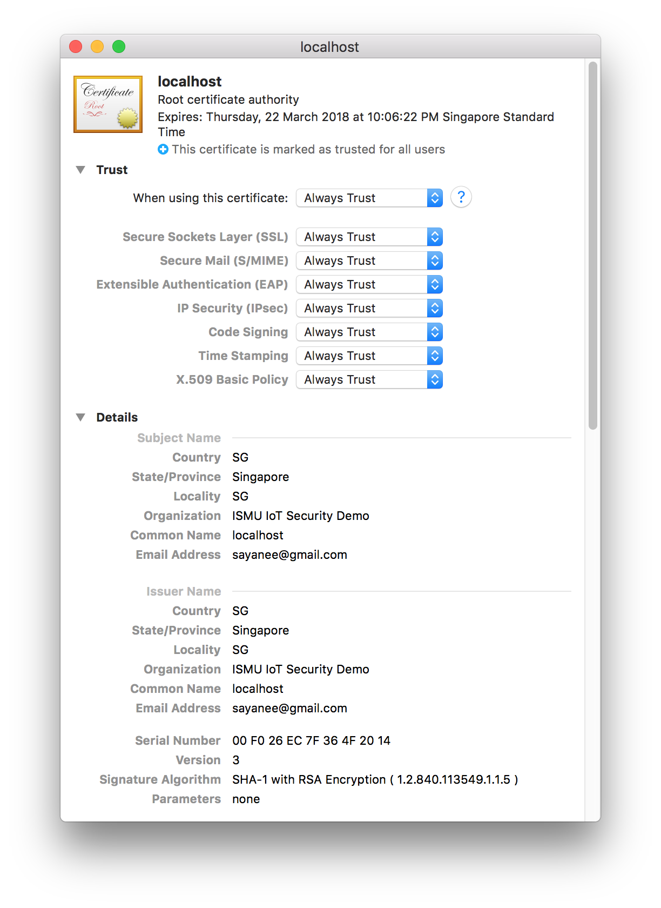
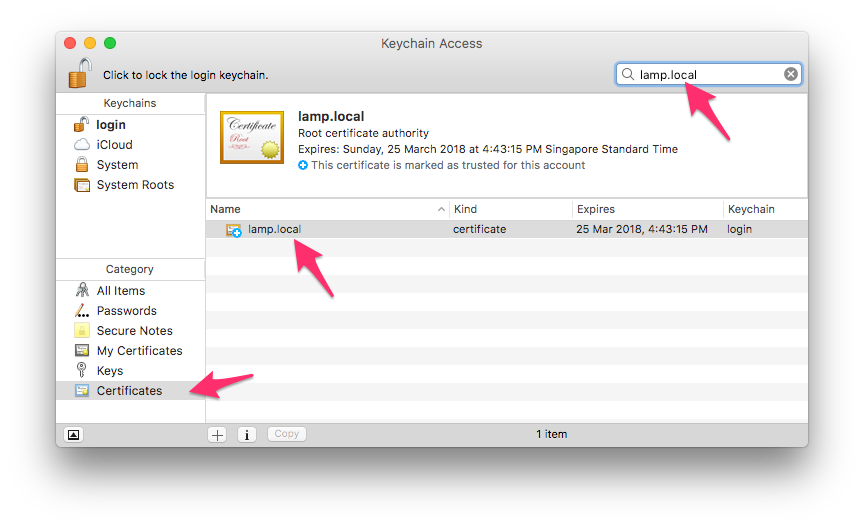

# demo

> Demo of a secure and insecure web page

## Getting started

1. Install dependancies with `npm i`
1. Generate new certificates
  - Ensure `Common Name` is `localhost` or another domain name E.g. `secure.local`

  ```sh
  $ openssl req -x509 -newkey rsa:2048 -keyout key.pem -out cert.pem -days 365

  Generating a 2048 bit RSA private key
  ......................+++
  ..........+++
  writing new private key to 'key.pem'
  Enter PEM pass phrase:
  Verifying - Enter PEM pass phrase:
  -----
  You are about to be asked to enter information that will be incorporated
  into your certificate request.
  What you are about to enter is what is called a Distinguished Name or a DN.
  There are quite a few fields but you can leave some blank
  For some fields there will be a default value,
  If you enter '.', the field will be left blank.
  -----
  Country Name (2 letter code) [AU]:SG
  State or Province Name (full name) [Some-State]:Singapore
  Locality Name (eg, city) []:Singapore
  Organization Name (eg, company) [Internet Widgits Pty Ltd]:IoT security demo                                   Organizational Unit Name (eg, section) []:
  Common Name (e.g. server FQDN or YOUR name) []:localhost
  Email Address []:sayanee@gmail.com
  ```
1. Add the certificate to KeyChain
1. Ensure it is `Always Trust`

  
1. Ensure that common Name on certificate generation and domain name is `localhost`

  
1. Start the servers on host machine to test

  ```sh
  npm start
  ```
1. Visit <localhost:4000> and <https://localhost:5000>
